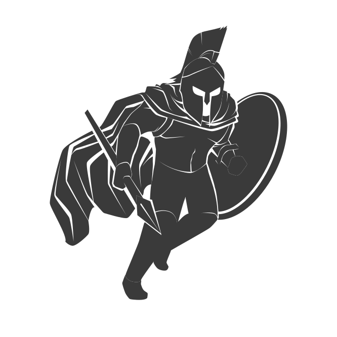

# Introduction

SPARTAN is a general purpose programming language written in Rust.
This language is intended to be plain and simple. Hence the name SPARTAN (it's not an acronym).

# Grammar

check [grammar.txt](grammar.md).

# Documentaion

Soon.

# Changelog

check [changelog.md](changelog.md)