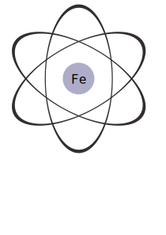

Ferrum is an interpreted general purpose programming language written in Rust.

## Grammar

check [grammar.ebnf](grammar.ebnf).

## Documentaion

Coming soon.

## Changelog

check [changelog.md](changelog.md)
